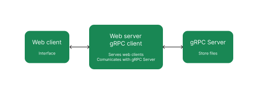

<div align="center">
    
</div>

# UFile System

The UFile System is a distributed file system that run locally. It has this functionalities:

- Upload a file
- Download a file
- Delete a file

The UFile Systems is based in three agents:

- Web client
- Web server / gRPC client
- gRPC server

The Web client comunicates with the Web server. The Web server is a gRPC client too and comunicates with the gRPC server. And the gRPC server stores your files. The following diagram illustrates the system architecture:

<div align="center">
    
</div>

## Install dependencies

First, you have to install all the dependencies. In the terminal execute:

```bash
bash configFile.sh
```

We recomend you run this bash in a [python virtual enviroment](https://docs.python.org/3/library/venv.html).

## Run

You need to run two systems to UFile Systems work. First open a terminal, go to '/grpc server' and execute:

```bash
python server.py
```

Now you need to open another terminal and go to '/web server'. After that, execute:

```bash
fastapi dev web_server.py
```

Congrats, the UFile System is running on http://localhost:8000!

To run in your local network in a different port you can use:

```bash
uvicorn web_server:app --host 0.0.0.0 --port 8081
```

for the port 8081 for example
obs: don't forget to allow the port on the local firewall of the os

## Repository organization

This repository is organized in this way:
- '/grpc server' contains the grpc server implementation
- '/media' contains media files
- '/protos' contains protobuffs necessary to create gRPC stubs
- '/web server' contains the web server implementation
- '/website' contains the website that are returned to clients

## Stack
- [gRPC](https://grpc.io/)
- [FastAPI](https://fastapi.tiangolo.com/)